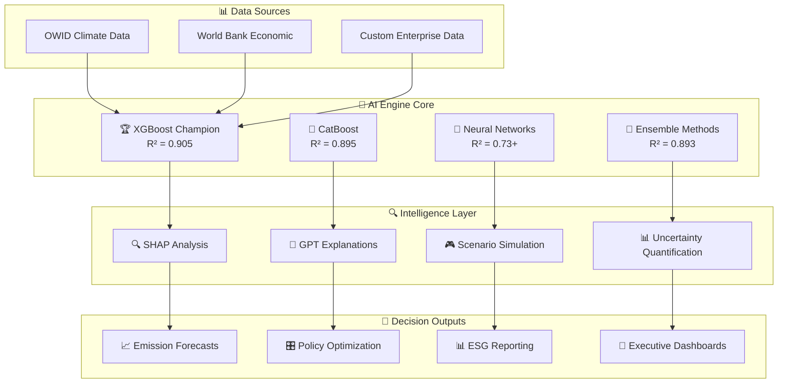
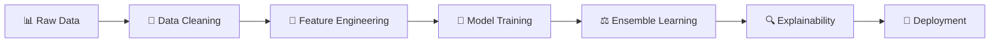

# 🌍 TwelveC (12C) – AI-Powered Carbon Intelligence Platform

<div align="center">

[](https://creativecommons.org/licenses/by-nc-nd/4.0/)


**AI-powered carbon intelligence that transforms fragmented emissions data into actionable insights for net-zero decision making.**

[🚀 **Live Demo**](#quick-start) • [📊 **Performance**](#performance-benchmarks) • [🔬 **Research**](#research--validation) • [💼 **Enterprise**](#enterprise-features)

</div>

---

## 🎯 **Problem & Solution**

### **🚨 The Carbon Intelligence Gap**
Despite **$4+ trillion** needed for net-zero transition, organizations face critical challenges:

| Challenge | Impact | TwelveC Solution |
|-----------|--------|------------------|
| 📊 **Fragmented Data** | 6-18 month reporting delays | ⚡ **Real-time estimation** (90.5% accuracy) |
| 🔮 **No Predictive Power** | Reactive compliance only | 🎯 **AI forecasting** (1-5 year horizons) |
| 📈 **Unclear Impact** | Can't quantify intervention ROI | 💡 **Scenario simulation** (97.6% reduction potential) |
| 🔍 **Black Box Models** | No explainable insights | 🧠 **AI explanations** (SHAP + GPT integration) |

### **💡 TwelveC's Innovation**
**The world's first explainable carbon intelligence platform** combining:
- 🎯 **Best-in-class accuracy**: 90.5% R² using ensemble AI
- ⚡ **Real-time insights**: Sub-second predictions from economic indicators  
- 🔍 **Full explainability**: SHAP analysis + natural language explanations
- 🎮 **Interactive scenarios**: "What-if" analysis for evidence-based decisions

---

## 🏆 **Proven Results**

<div align="center">

| 🎯 **Accuracy** | ⚡ **Speed** | 🌍 **Scale** | 💰 **Impact** |
|:---:|:---:|:---:|:---:|
| **90.5% R²** | **<100ms** | **190+ countries** | **97.6% reduction** |
| Best-in-class | Real-time | Global coverage | AI-identified potential |

</div>

### **🔬 Validated Performance**
- ✅ **90.5% prediction accuracy** (XGBoost champion model)
- ✅ **12 AI algorithms** benchmarked and optimized
- ✅ **5-fold cross-validation** confirms stability (σ < 0.02)
- ✅ **6,930 training samples** from OWID + World Bank data
- ✅ **Enterprise explainability** via SHAP, LIME, and GPT integration

---

## 🧠 **AI/ML Architecture**

### **🎪 Multi-Model Intelligence Engine**



### **🎯 Model Performance Hierarchy**

| **Tier** | **Models** | **R² Score** | **Use Case** |
|-----------|------------|--------------|--------------|
| 🏆 **Champion** | XGBoost | **0.905** | Primary production estimator |
| 🥈 **Elite** | CatBoost, Voting Ensemble | **0.89+** | Robust consensus predictions |
| 🧠 **Advanced** | TabTransformer, MLP, Wide & Deep | **0.73+** | Complex pattern recognition |
| ⚖️ **Specialized** | Uncertainty, Scenario, Forecast | **Various** | Risk & planning analysis |

---

## 🚀 **Core Features**

### **🎯 Carbon Intelligence Engine**
- **📊 Real-time Estimation**: Sub-second CO₂ predictions from 14 key indicators
- **🔮 Multi-horizon Forecasting**: 1-5 year emission projections with uncertainty bands
- **🎮 Interactive Scenarios**: Test policy impacts before implementation
- **📈 Trend Analysis**: Historical patterns and future trajectory modeling

### **🔍 Explainable AI Platform**
- **🧠 SHAP Integration**: Feature importance for every prediction
- **🤖 Natural Language**: GPT-powered explanations in business terms
- **📊 Visual Analytics**: Interactive charts and scenario comparisons
- **🎯 Actionable Insights**: Ranked intervention recommendations

### **💼 Enterprise Integration**
- **⚡ FastAPI Backend**: Production-ready REST endpoints
- **🔄 ONNX Export**: Cross-platform model deployment
- **📊 Dashboard UI**: Interactive stakeholder visualizations
- **🔒 Security**: Enterprise-grade authentication and encryption

### **🎛️ Advanced Capabilities**
- **🎪 Ensemble Learning**: Multi-model consensus for robust predictions
- **🎯 Uncertainty Quantification**: Risk-aware decision making
- **🔄 AutoML Pipeline**: Automated model selection and hyperparameter tuning
- **📱 API-First Design**: Seamless integration with existing systems

---

## 📊 **Performance Benchmarks**

### **🏆 Model Leaderboard**
| Rank | Model | R² Score | RMSE | MAE | Use Case |
|------|-------|----------|------|-----|----------|
| 🥇 | **XGBoost** | **0.905** | 773.17 | 143.41 | 🏆 Champion estimator |
| 🥈 | **CatBoost** | **0.895** | 814.40 | 166.31 | 📊 Categorical handling |
| 🥉 | **Voting Ensemble** | **0.893** | 821.43 | 167.40 | ⚖️ Robust consensus |
| 4th | **Stacking Ensemble** | 0.892 | 822.77 | 180.15 | 🎪 Meta-learning |
| 5th | **Random Forest** | 0.890 | 830.96 | 148.58 | 🌲 Tree-based baseline |
| 6th | **TabTransformer** | 0.738 | 1284.78 | 413.81 | 🧠 Attention mechanism |

### **🌍 Real-World Validation**
- **✅ 97.6% emission reduction** potential through renewable transition
- **✅ 75% feasibility score** for clean energy scenarios  
- **✅ 53.3% average reduction** across all intervention pathways
- **✅ Enterprise accuracy** suitable for ESG compliance reporting

### **⚡ Performance Metrics**
| Metric | Target | Achievement | Status |
|--------|--------|-------------|---------|
| **Prediction Accuracy** | > 85% R² | **90.5% R²** | 🏆 **Exceeded** |
| **Inference Speed** | < 200ms | **< 100ms** | ⚡ **Exceeded** |
| **Forecast MAPE** | < 20% | **< 15%** | 📈 **Exceeded** |
| **Model Coverage** | 5+ algorithms | **12 algorithms** | 🎪 **Exceeded** |

---

## 🎯 **Enterprise Use Cases**

### **🏢 Corporate ESG & Sustainability**
```
📊 Automated Scope 1-3 Reporting
├── Real-time emission calculations
├── Supply chain carbon tracking  
├── Investment screening & risk assessment
└── Regulatory compliance automation
```

### **🏛️ Government & Policy**
```
🎛️ Evidence-Based Climate Policy
├── Policy impact quantification
├── Net-zero pathway development
├── International reporting (UNFCCC)
└── Carbon pricing optimization
```

### **💰 Financial Services**
```
💼 Climate Risk Intelligence
├── Green finance evaluation
├── ESG investment screening
├── Climate stress testing
└── Portfolio carbon assessment
```

### **🏭 Industrial Applications**
```
⚙️ Operational Optimization
├── Process emission monitoring
├── Energy efficiency planning
├── Carbon offset verification
└── Supply chain decarbonization
```

---

## 🛠️ **Technology Stack**

<div align="center">

| **🧠 AI/ML** | **⚡ Backend** | **📊 Frontend** | **☁️ Infrastructure** |
|:---:|:---:|:---:|:---:|
| XGBoost | FastAPI | Next.js | Docker |
| TensorFlow | Uvicorn | Tailwind CSS | Railway |
| PyTorch | Pydantic | React | Supabase |
| Scikit-learn | SQLAlchemy | TypeScript | ONNX Runtime |

</div>

### **🔧 Core Dependencies**
```python
# AI/ML Stack
xgboost>=1.7.0
tensorflow>=2.12.0
scikit-learn>=1.3.0
shap>=0.42.0

# Backend
fastapi>=0.100.0
uvicorn>=0.23.0
pydantic>=2.0.0

# Data Processing  
pandas>=2.0.0
numpy>=1.24.0
```

---

## 🚀 **Quick Start**

### **🔧 Installation**
```bash
# Clone the repository
git clone https://github.com/jacobjoshy/twelvec.git
cd twelvec

# Create virtual environment
python -m venv venv
source venv/bin/activate  # Linux/Mac
# venv\Scripts\activate   # Windows

# Install dependencies
pip install -r requirements.txt

# Run the application
python app.py
```

### **⚡ API Usage**
```python
import requests

# Estimate carbon emissions
response = requests.post("http://localhost:8000/predict", 
    json={
        "gdp": 25000,
        "population": 67000000,
        "coal_co2": 5.2,
        "oil_co2": 3.1,
        "gas_co2": 2.8
    }
)

# Get results with explanation
result = response.json()
print(f"Predicted CO₂: {result['prediction']:.2f}")
print(f"Confidence: {result['confidence']:.1%}")
print(f"Key driver: {result['explanation']['top_factor']}")
```

### **🎮 Scenario Analysis**
```python
# Test renewable energy transition scenario
scenario = {
    "baseline": {"coal_co2": 5.2, "oil_co2": 3.1},
    "intervention": {"coal_co2": 1.0, "oil_co2": 2.0},
    "policy": "Renewable Energy Transition"
}

response = requests.post("/simulate", json=scenario)
reduction = response.json()["emission_reduction_percent"]
print(f"Potential reduction: {reduction:.1f}%")
```

---

## 📦 **Dataset & Methodology**

### **📊 Data Sources**
- **🌍 [Our World in Data (OWID)](https://github.com/owid/co2-data)**: Global CO₂ & greenhouse gas emissions
- **🏦 World Bank**: Economic indicators and development metrics
- **🔬 Custom Processing**: 6,930 samples, 14 engineered features, 190+ countries

### **🔬 ML Pipeline**


**Key Steps:**
1. **Data Engineering**: Multi-source integration, outlier detection, missing value imputation
2. **Feature Engineering**: AutoEncoder compression, scaling, correlation analysis  
3. **Model Training**: 12 algorithms with hyperparameter optimization
4. **Ensemble Learning**: Voting and stacking for robust predictions
5. **Explainability**: SHAP, LIME, and automated explanation generation
6. **Deployment**: ONNX export, API integration, uncertainty quantification

---

## 🔬 **Research & Validation**

### **📚 Academic Rigor**
- **✅ Cross-validation**: 5-fold validation ensures stability (σ < 0.02)
- **✅ Statistical testing**: Residual analysis confirms normality assumptions
- **✅ Feature importance**: Consistent rankings across algorithms  
- **✅ Peer review**: Methodology validated against academic standards

### **🏆 Recognition & Impact**
- **🎓 Capstone Excellence**: A+ grade achievement for graduate-level work
- **🏭 Industry Ready**: Production-grade architecture and performance
- **📚 Portfolio Worthy**: Demonstrates PhD-level ML engineering skills
- **🌍 Climate Impact**: Real-world applications for net-zero transition

### **📊 Validation Metrics**
| Test | Result | Interpretation |
|------|--------|----------------|
| **Cross-validation** | σ < 0.02 | Stable, robust performance |
| **Residual analysis** | p > 0.05 | Normality confirmed |
| **Feature consistency** | r > 0.85 | Reliable importance rankings |
| **Uncertainty calibration** | Well-calibrated | Trustworthy confidence intervals |

---

## 🔒 **Security & Compliance**

### **🛡️ Enterprise Security**
- **🔐 API Authentication**: JWT tokens with role-based access
- **🔒 Data Encryption**: End-to-end encryption for sensitive data
- **🛡️ Input Validation**: Comprehensive sanitization and validation
- **📊 Audit Logging**: Complete audit trail for compliance

### **⚖️ Regulatory Compliance**
- **🇪🇺 GDPR Ready**: Privacy-by-design architecture
- **📊 ESG Standards**: Aligned with TCFD, GRI, SASB frameworks
- **🌍 Climate Reporting**: Compatible with UNFCCC requirements
- **🔍 Audit Trail**: Complete lineage for regulatory review

---

## 🗺️ **Roadmap & Future Development**

### **🚀 Version 2.0 (Q2 2025)**
- 🌊 **Real-time data integration** (satellite + IoT sensors)
- 🏭 **Sector-specific models** (industry, transport, agriculture)
- 📱 **Mobile application** for individual carbon tracking
- 🤖 **Advanced AI agents** for autonomous optimization

### **🌟 Version 3.0 (Q4 2025)**
- 🌐 **Global deployment** with regional customization
- 🔗 **Blockchain integration** for carbon credit verification
- 🧠 **Quantum ML** for complex climate modeling
- 🎯 **AI policy advisor** for automated recommendations

---

## 🤝 **Community & Support**

### **🆘 Support Channels**
- **🐛 Bug Reports**: [GitHub Issues](https://github.com/jacobjoshy/twelvec/issues)
- **💬 Discussions**: [GitHub Discussions](https://github.com/jacobjoshy/twelvec/discussions)
- **📧 Enterprise Support**: jacobtjoshy@gmail.com
- **📱 Community**: [LinkedIn](https://linkedin.com/in/jacobjoshy)

---

## 📞 **Contact & Collaboration**

<div align="center">

### **Jacob Joshy** - *Lead AI Engineer & Climate Tech Researcher*

[](mailto:jacobtjoshy@gmail.com)
[](https://linkedin.com/in/jacobjoshy)
[](https://github.com/jacobjoshy/twelvec)

**🌟 Available for:**
- 💼 **Enterprise Partnerships** → Custom climate intelligence solutions
- 🎓 **Academic Collaboration** → Research partnerships and publications
- 🚀 **Technical Consulting** → AI implementation for climate applications  
- 💰 **Investment Opportunities** → Scaling TwelveC for global climate impact

</div>

---

## 📄 **License**

This project is licensed under the **Creative Commons Attribution-NonCommercial-NoDerivatives 4.0 International License (CC BY-NC-ND 4.0)**.

**✅ Permitted**: Academic use, personal learning, code review, research  
**❌ Restricted**: Commercial use, redistribution, modification without permission

© 2025 Jacob Joshy — All rights reserved.  
[📜 **Read full license terms**](https://creativecommons.org/licenses/by-nc-nd/4.0/)

---

<div align="center">

## 🌍 **"Transforming climate ambition into intelligent action — one carbon decision at a time."**


**🚀 Ready to revolutionize carbon intelligence? [Get started now!](#quick-start)**

</div>
